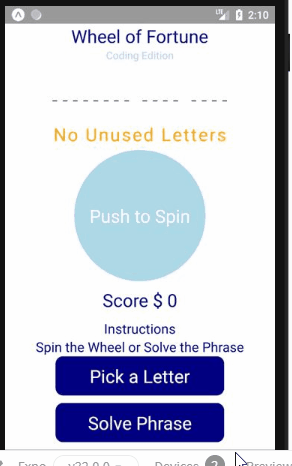
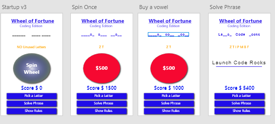

# Wheel of Forturne

### Table of Contents
1. Demo Link
2. Purpose
3. Motivation
4. Objectives
5. Wireframe
6. Technologies Used

### Demo Link: [Wheel of Fortune](https://snack.expo.io/@jcsmileyjr/wheel-of-fortune)

### Purpose:
A clone of the T.V. show made into a mobile app. 

### Motivation:
This project was used to practice developing with React Native and wire-framing with Adobe XD.  

### Objectives:
* The user can spin the wheel to get a award amount for each letter correctly chosen or get the Bankrupt award
* The user can pick letters and increase the score based on correct letters
* The user is score is subtracted by -250 for each vowel
* The user can chose to solve the phrase and win the game

### WireFrame

### This app was built with the following technologies:
**React Native:** JavaScript mobile app framework 
 
**Git-Hub:** Web-based version control repository and Internet hosting service
 
**Flexbox:** A CSS based layout technology for building responsive websites

**Abode XD** A wire-framing tool used to create a mockup/visual of what is to be coded
  
**JavaScript:** Object-oriented programming language for web pages
 
**HTML:** Mark-up language for creating web pages 
 
**CSS:** A formatting language for styling web pages
 
*Create by JC Smiley in March of 2019*
